<h1 align="center">
  <br>
  
  <br>
  Atoll VPN
  <br>
</h1>

<p align="center">
  A Windows desktop VPN client with a tray-based interface, built on WinUI 3 and powered by <a href="https://github.com/SagerNet/sing-box">sing-box</a>
</p>

<p align="center">
  
  
  
  
</p>

<p align="center">
  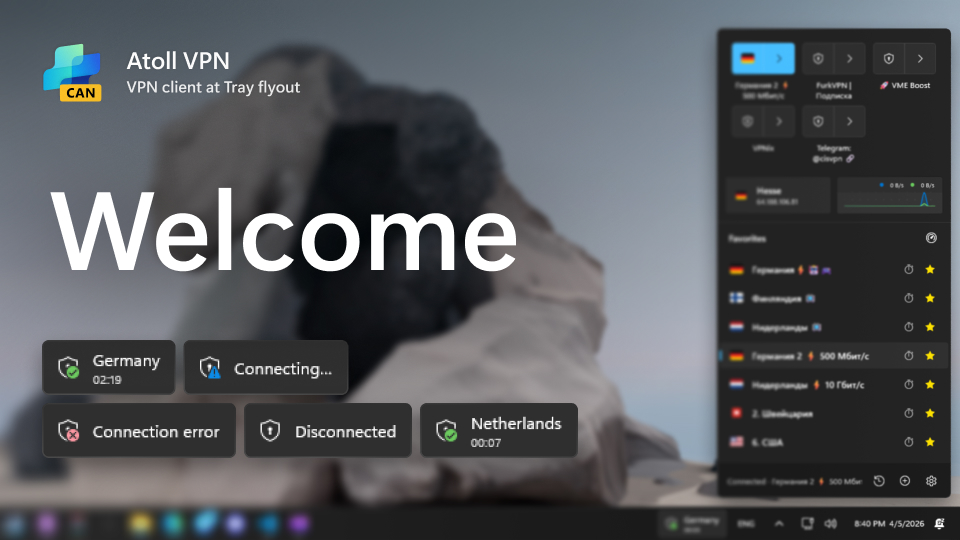
</p>

---

## Table of Contents

- [Screenshots](#screenshots)
- [Features](#features)
- [Installation](#installation)
- [Branches](#branches)
- [Building from Source](#building-from-source)
- [Acknowledgements](#acknowledgements)
- [License](#license)

## Screenshots

<details>
<summary><b>Control Panel</b> — tray flyout with connection status, subscriptions, and favorite servers</summary>
<p align="center">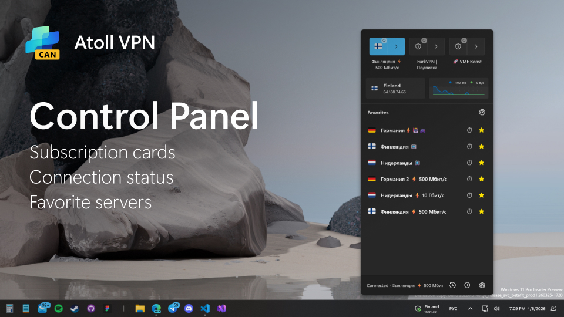</p>
</details>

<details>
<summary><b>Taskbar Widget</b> — real-time connection status embedded in the Windows taskbar</summary>
<p align="center">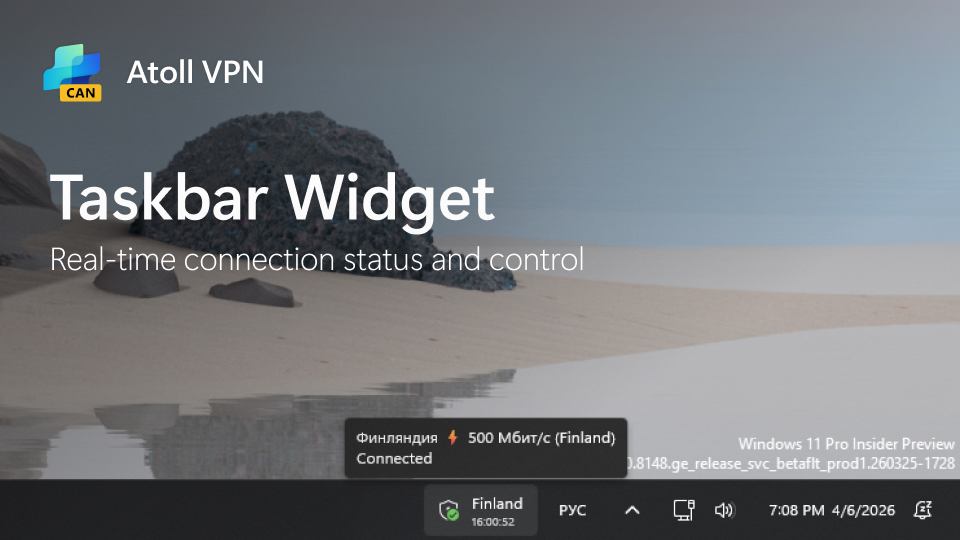</p>
</details>

<details>
<summary><b>Servers List</b> — per-subscription server list with batch latency ping and auto-select</summary>
<p align="center">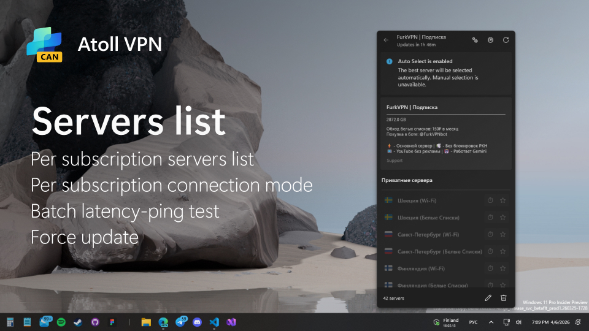</p>
</details>

<details>
<summary><b>Add Subscription</b> — Clash/SingBox URLs or direct server links with auto-update</summary>
<p align="center">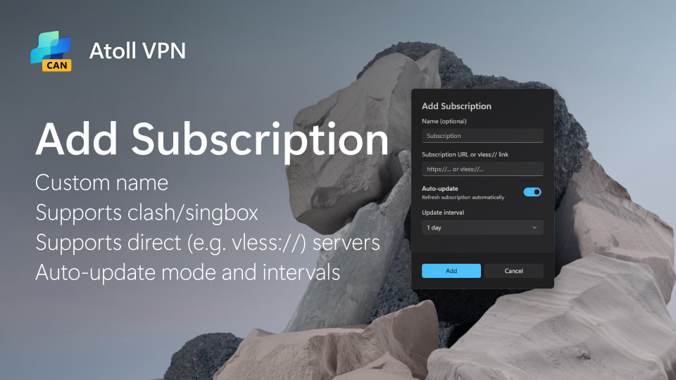</p>
</details>

<details>
<summary><b>Connection History</b> — live log of outbound, inbound, and DNS connections</summary>
<p align="center">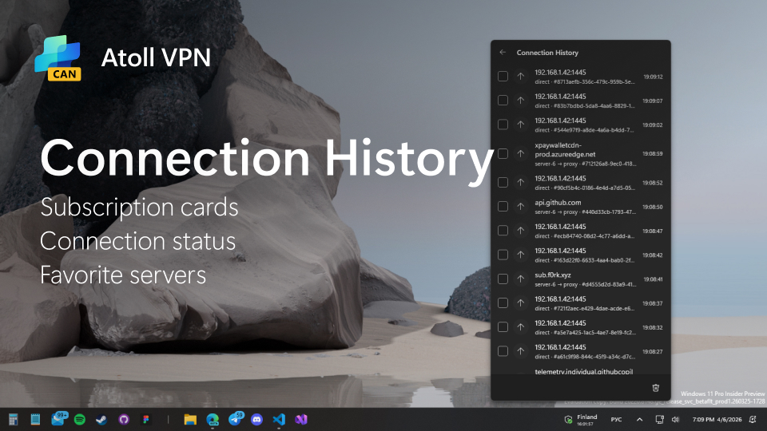</p>
</details>

<details>
<summary><b>Settings</b> — application, VPN connection, routing rules, and about</summary>
<p align="center">
  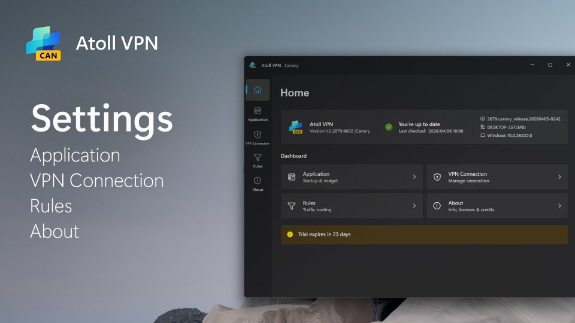<br><br>
  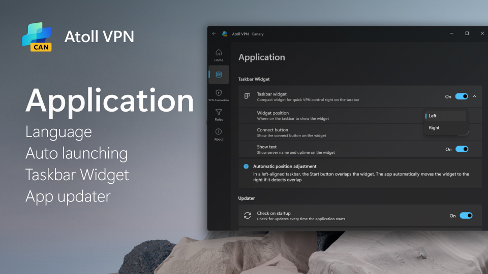<br><br>
  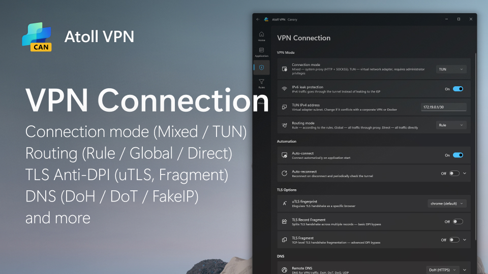<br><br>
  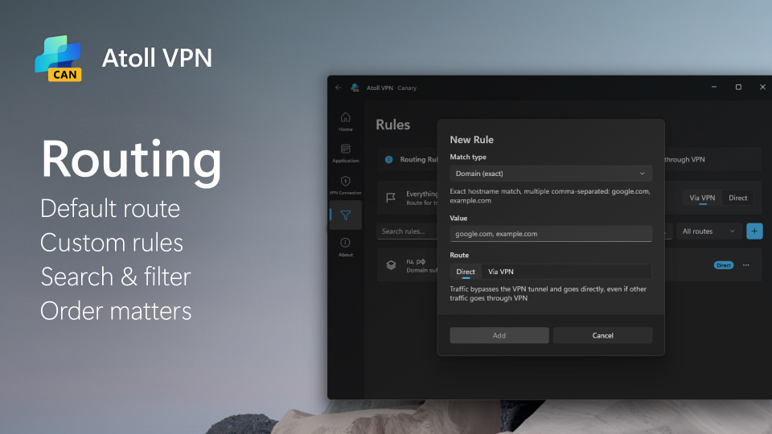
</p>
</details>

<details>
<summary><b>Connection Quality</b> — automatic warning when VPN quality degrades</summary>
<p align="center">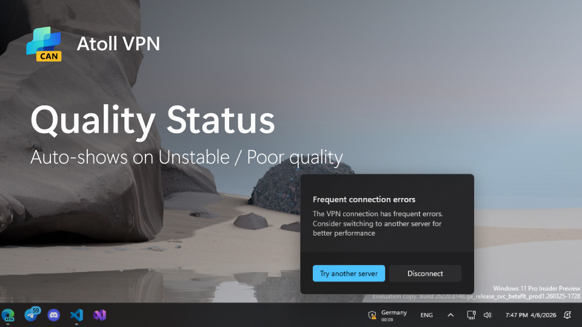</p>
</details>

<details>
<summary><b>System Proxy</b> — automatic system proxy configuration with tray menu</summary>
<p align="center">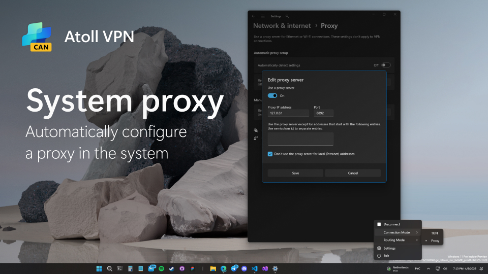</p>
</details>

<details>
<summary><b>Setup Wizard</b> — first-run onboarding with language selection and basic settings</summary>
<p align="center">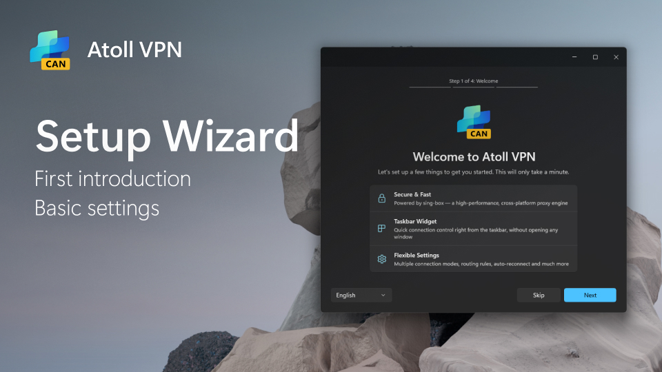</p>
</details>

## Features

### Connection & Protocols

- **Multi-protocol support:** VLESS, VMess, Trojan, Shadowsocks, Hysteria2, TUIC — with H2, QUIC, HTTPUpgrade, and WebSocket transports
- **Connection modes:** TUN (virtual network adapter) and Mixed (HTTP + SOCKS5 system proxy)
- **Routing modes:** Rule-based, Global, and Direct — switchable from tray menu or settings
- **Advanced TLS:** uTLS fingerprint, TLS fragment, record fragment, and fallback delay for DPI bypass
- **DNS options:** configurable remote (DoH, DoT, DoQ, UDP) and local DNS servers; optional FakeIP mode with persistent cache
- **IPv6 leak protection:** route IPv6 traffic through the tunnel to prevent leaks

### Server Management

- **Subscription import:** Clash and SingBox compatible URLs, or direct server links (e.g. `vless://...`)
- **Auto-update:** subscriptions refresh automatically on a configurable interval
- **Multi-server outbound:** URL-test (auto latency-based selection) or Selector with per-subscription persistence
- **Batch latency ping:** measure round-trip latency for all servers or only favorites
- **Shareable server URLs:** copy a direct link for any server from the context menu
- **Favorites:** mark servers for quick access; favorites survive subscription refreshes

### Interface

- **Tray flyout:** Windows 11-style control panel opening from the system tray
- **Taskbar widget:** WinUI 3 widget embedded in the taskbar with VSync-paced animations and optional text labels
- **Connection quality monitoring:** tray icon and widget reflect connection health; a warning flyout appears when quality degrades
- **Connection history:** live log of outbound, inbound, and DNS connections
- **System tray menu:** quick mode toggle, routing mode submenu, connection stats, and settings access
- **Theme-aware tray icon:** automatically follows Windows Light/Dark system theme

### System

- **Auto-connect / auto-reconnect:** configurable startup behavior with crash recovery and exponential backoff
- **Built-in updater:** checks GitHub releases, downloads in background, notifies when ready
- **OOBE onboarding:** first-run wizard covering language, app settings, VPN settings, and subscription import
- **Full localization:** English and Russian UI with live language switching (no restart required)
- **Routing rules:** per-domain, per-suffix, per-keyword, and per-process rules with search and filter

## Installation

Download the latest installer from the [Releases](../../releases) page.

| Format | Notes |
|---|---|
| `.exe` (Inno Setup) | Recommended for end users, no certificate required |
| `.msixbundle` | Requires one-time trust of the included `.cer` file |

### Runtime requirements

- Windows 10 version 1809 (build 17763) or later
- .NET 10.0 Desktop Runtime
- Windows App SDK 1.8


## Branches

The app ships through multiple release channels. Each branch has its own version counter and icon variant.

| Branch | Purpose | Build frequency |
|---|---|---|
| `stable` | Production releases | Manual |
| `canary` | Nightly / CI builds | Every commit |

The active branch is set at build time with `-p:AppBranch=<branch>`. Debug builds default to `canary`, Release builds default to `stable`.

## Building from Source

### Prerequisites

- Visual Studio 2022 with:
  - .NET desktop development workload
  - Windows application development (WinUI / Windows App SDK) workload
- .NET 10 SDK
- Node.js 18+ (for the version generation script)
- sing-box core binary — run `.\Installer\Singbox.ps1` to download it automatically

### Build

```powershell
# Restore and build (Canary)
dotnet build -c Debug

# Release build for x64
dotnet build -c Release -p:Platform=x64

# Release build for a specific branch
dotnet build -c Release -p:Platform=x64 -p:AppBranch=canary
```

Supported platforms: `x64`, `ARM64`.

The build automatically generates `AppVersion.g.cs` from `Installer\Version\version.json` via `Installer\Version\index.js`. The version is bumped on each build; use `-p:VersionBumpedExternally=true` to skip the bump.

The sing-box core binary (`AtollVPN Core.exe`) is expected under `Installer\bin\singbox\{platform}\` and is copied to the output directory during build.

### Packaging

```powershell
# Interactive — prompts for platform, format, and branch
.\Installer\Release.ps1

# Specific platform and format
.\Installer\Release.ps1 -Platform x64 -OutputFormat Inno

# Production — builds all platforms and both formats
.\Installer\Release.ps1 -Mode prod

# Update the sing-box core to the latest version
.\Installer\Singbox.ps1
```

### Data Storage

Application data (sing-box config, subscriptions, favorites, selections) is stored under `%ProgramData%` with GZip compression.

## Acknowledgements

- [sing-box](https://github.com/SagerNet/sing-box) — proxy engine
- [Windows App SDK / WinUI 3](https://github.com/microsoft/WindowsAppSDK) — UI framework
- [Inno Setup](https://jrsoftware.org/isinfo.php) — installer compiler

## License

Licensed under the MIT License. See individual source files for copyright notices.

The bundled [sing-box](https://github.com/SagerNet/sing-box) binary is subject to its own license.
